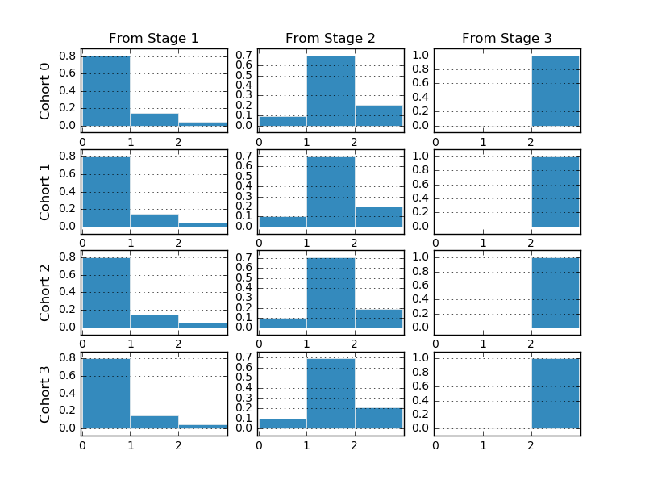
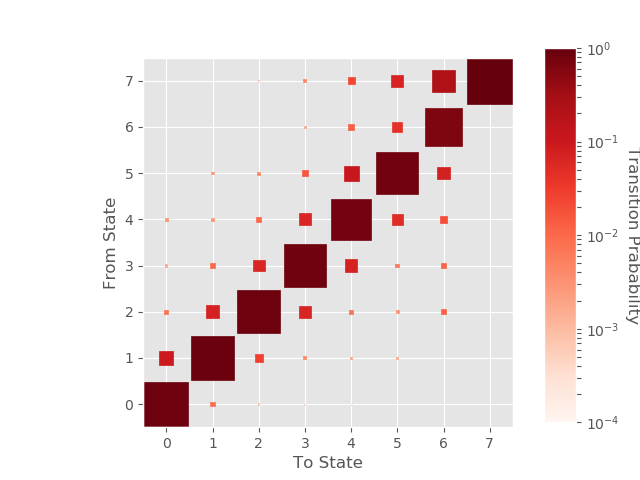

Intro
=========================
transitionMatrix is a Python powered library for the statistical analysis and visualization of state transition 
phenomena. It can be used to analyze any dataset that captures timestamped transitions in a discrete state space. 
Use cases include credit rating transitions, system state event logs etc. For example you can use transitionMatrix to

-   Estimate transition matrices from historical event data using a variety of estimators
-   Visualize event data and transition matrices
-   Manipulate transition matrices (generators, comparisons etc.)
-   Provide standardized data sets for testing

Key Information
================

* Author: Open Risk, <http://www.openriskmanagement.com>
* License: Apache 2.0
* Code Documentation: Read The Docs, <https://transitionmatrix.readthedocs.io/en/latest/index.html>
* Mathematical Documentation: Open Risk Manual, <https://www.openriskmanual.org/wiki/Transition_Matrix>
* Development website: <https://github.com/open-risk/transitionMatrix>
* Production instance (API): <https://www.opencpm.com>

Support and Training
=========================

* The Open Risk Academy has free courses demonstrating the use of the library. The current list is: 
    * Analysis of Credit Migration using Python TransitionMatrix: <https://www.openriskacademy.com/course/view.php?id=38>
* The Academy also offers chat functionality - you must create a free account first to join the platform: <https://www.openriskacademy.com/login/index.php>

Installation
============

These instructions are for linux systems only. With small adaptations the library can be used in all platforms supporting python.

Download the sources in your preferred directory:

~~~~ {.sourceCode .bash}
git clone https://github.com/open-risk/transitionMatrix
~~~~

It is advisable to install the package via virtualenv

~~~~ {.sourceCode .bash}
virtualenv tm_test
source tm_test/bin/activate
~~~~

Make sure first you have numpy installed in the virtual environment

~~~~ {.sourceCode .bash}
pip3 install numpy
python3 setup.py install
~~~~

File structure
==============

datasets/ Contains a variety of datasets useful for getting started with transitionMatrix
tests/ Testing suite
transitionMatrix/ The library
   model.py Main data structures
   estimators/ Estimator methods
   utils/ Helper classes and methods
   thresholds/ Algorithms for calibrating AR(n) process thresholds to input transition rates
   portfolio\_analytics/ Collection of portfolio analytic solutions
   examples/ Usage examples

Testing
=======

It is a good idea to run the test suite. Before you get started:

-   Adjust the source directory path in transitionMatrix/\_\_init\_\_ and then issue the following in at the root of the distribution
-   Unzip the data files in the datasets directory

~~~~ {.sourceCode .bash}
python3 test.py
~~~~

Usage
=====

Look at the examples directory for a variety of typical workflows - Generating transition matrices from data - Manipulating transition matrices - Estimating thresholds given a multi-period transition matrix set - Generating loss distributions analytically

Dependencies
============

-   TransitionMatrix is written in Python and depends on numerical and data processing Python libraries (Numpy, Scipy, Pandas)
-   The Visualization API depends on Matplotlib
-   The precise dependencies are listed in the requirements.txt file.
-   TransitionMatrix may work with earlier versions of these packages but this has not been tested.

Relationship with other open source projects
============================================

-   The package does not provide reference implementations of Markov Chain models for which various packages already exist
-   The package is focusing instead on "model free" analysis (limited facilities might be included for convenience)
-   It is somewhat similar to etm, an R package for estimating empirical transition matrices
-   There is some conceptual overlap with survival models like lifelines, but in general the dimensionality of state space requires a different set of tools

Examples
========

Plotting individual transition trajectories

Sampling transition data

Estimation of transition matrix

Visualization of transition matrix

Generating stochastic process transition thresholds

Computation and Visualization of Credit Curves

